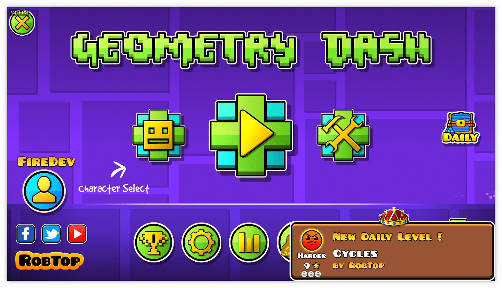

# GDUtils
**By [Jouca](https://github.com/Jouca) and [Firee](https://github.com/FireMario211)**
A Geometry Dash Mod for adding more tools such as Notifications, auto-song mute, game fixes & more!

## Need help?
* You can join our [Discord server](https://discord.gg/MU4Rpc6xbJ) for **any assistance** or about **next updates**, **sneak peeks** & **more**!

## Features

### Realtime Notifications
* This includes any new levels and lists being **rated**, new **daily levels**, new **weekly levels!** and **new daily chests!**
* This also includes the new difficulty faces, and the new **Legendary** and **Mythic** rating.
* Notifications are **highly customizable**, you can set the __position__, __size__, and __how long they can stay on screen!__
* You can also set when notifications **should appear** or **not appear**! This includes __being shown in levels__, __in the editor__, __etc__.

### More Leaderboards
* Thanks to [Updated Leaderboards](https://discord.gg/HpC5Xc3JMh), it's now possible for you to view leaderboards for users with the most **Stars**, **Moons**, **Diamonds**, **User Coins**, **Demons!** and **Creator Points**! You can also view your accurate leaderboard placement.
* Leaderboards are now **infinite**! You can see the placement of every Geometry Dash players (registered with [Updated Leaderboards](https://discord.gg/HpC5Xc3JMh)) with this one.
* You can also see **leaderboards by countries**!

### View Demon List Placement
* Instead of having to go to Pointercrate to view the demon placement of a level, you can now **view the position** of an extreme demon!

### Level URL Sharing Feature (Windows Only)
* You can share levels easily by copying the URL of it and sending it to your friends! Or you can quickly go to a level by going to `https://gdutils.com/{levelid}` (Replacing `{levelid}` with the ID of the level)

### Moderator List 
* You can view the list of **Elder Moderators**/**Moderators**/**Leaderboard Moderators** and their socials!

### Gauntlets redesign
* Gauntlets are now redesigned to make them more **EPIC**, with **particles** and **new textures**!

### Auto-Mute Spotify (or any application)
* Allows you to **auto mute Spotify** or any other applications when you are __playing a level__, __playtesting in the editor__, and more!
* **IMPORTANT for Mac Users:** Geometry Dash may request access to "System Events" and another app for muting Spotify or another application. This allows the game to detect running applications.

### Custom backgrounds
* Custom your **backgrounds colors** or you can even make it **transparent**!

### Extra additions to Friends List
* The additions added include being able to **search usernames** if you have a long friend list, or using the **scroll buttons**!

### Moderator Info
* You can view a description of either the Moderator, Elder Moderator, or other badges users have by clicking on the badge itself on the profile!

## Libraries Used
- [Geode](https://github.com/geode-sdk/geode)
- [socket.io-client-cpp](https://github.com/socketio/socket.io-client-cpp)
- [pl_mpeg](https://github.com/phoboslab/pl_mpeg)

## Credits
* [Jouca](https://twitter.com/JoucaJouca)
* [Firee](https://youtube.com/@gdfiree)
* [Maverick](https://www.youtube.com/channel/UCoFBsXJ-6o6l6ZYP-k6DE_g)
* [nekitdev](https://twitter.com/nekitdev)

**Thank you to RobTopGames for his trust on the mod.**

## License
This project is created by [Jouca](https://github.com/Jouca) under the [GNU General Public License v3.0](https://choosealicense.com/licenses/gpl-3.0/), read more by clicking on the highlighted name.
